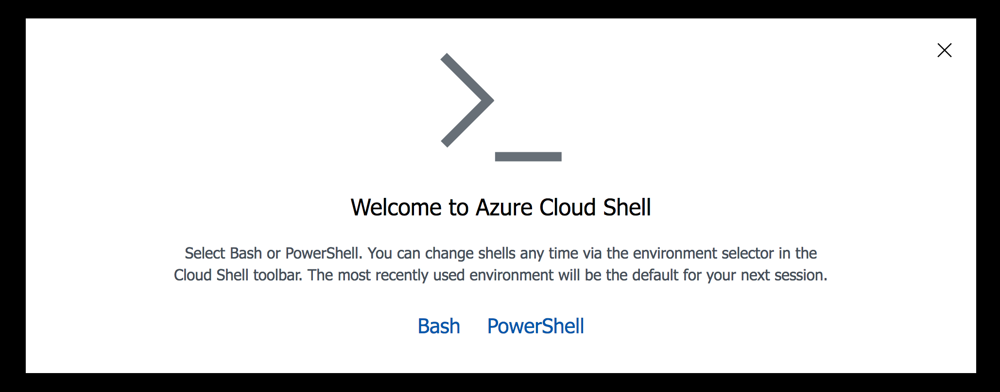

# VScode instance for Mojifier Workshop 
This is a tailored version of Visual Studio code, that you can run in the browser to complete the Mojifier workshop. It uses [https://coder.com/](https://github.com/codercom/code-server). 

> The actual workshop code can be found here: [Mojifier on Github](https://github.com/MicrosoftDocs/mslearn-the-mojifier.git)

# Getting Started

## Run Locally on your machine

**Pre-requisite:** you will need to have Docker installed on your device. You can follow instructions to install [here](https://docs.docker.com/install/). 

1. Once you have docker installed, simply run the below in your terminal:  

    `docker run -p 3000:3000 -p 7071:7071 deanobalino/mojifier  --port=3000 --password=changeme`

    ### Parameters
    - `--password`:  Password to protect and logon to web version of Visual Studio Code

2. You should then be able to access your instance of Visual Studio code at:

    `http://localhost:3000/`

3. Login with the `--password` that you chose when running the container.

## Deploy to Azure  
**NOTE THIS IS EXPERIMENTAL AND MAY NOT WORK**
----------------------------------------------
**Pre-requisite:** you will need an Azure account. You can sign up [here](https://azure.microsoft.com/en-gb/free).  

1. Login to Azure at [portal.azure.com](https://portal.azure.com)

2. Click on the Azure Cloud Shell Icon  


3. Select a Bash terminal within Cloud Shell 


4. Run the following command in the Cloud Shell   
**Be sure to change the `-p` parameter with your own password**

`curl -s https://raw.githubusercontent.com/deanobalino/coder-mojifier-workshop/master/deploy.sh | bash -s -- -p hello`

5. Once complete, you will be presented with the URL to access your Azure Hosted instance of VS Code. Click on thisto access your IDE.

### Deployed Resources
- Microsoft.ContainerInstance/containerGroups
- Microsoft.Storage/storageAccounts
- Microsoft.ResourceGroup

###Troubleshooting
- If you get a 400 auth token error. Run 'az login` in the Azure cloud shell and re-authenticate using the URL and Access Code.

## Deploying Function Code to Azure when using Docker VSCode

When running vscode in a docker container as per this guide, there is an outstanding issue with authenticating Azure extensions. 

Therefore, when you get to the 'Deploy to Azure' section of the workshop on Microsoft Learn, you will need to divert to these instructions.

1. Open up the terminal in vscode and type:


```
az login
``` 

2. Follow the instructions, open https://microsoft.com/devicelogin, login to your Azure account and type the code provided in the terminal. 

3. We will need to create our Function App in Azure, type the following:

```
# Create Resource Group
az group create --name mojifier-workshop --location westeurope

# Create Storage Account
az storage account create --name mojifierworkshop --location westeurope --resource-group mojifier-workshop --sku Standard_LRS

# Create Function App
az functionapp create \
--resource-group mojifier-workshop \
--consumption-plan-location westeurope \
--name mojifierWorkshop \
--storage-account mojifierworkshop \
--runtime node
```

4. Next, we will deploy our mojifier code to the Function App using the `func` cli tool.  

We will also use the `--publish-local-settings` flag to syncronise our Face API details in `local.settings.json` with our Application Settings in Azure.

```
func azure functionapp publish mojifierWorkshop --publish-local-settings
```

> You can use this single command to deploy to this function app whenever you need to re-deploy your code.


